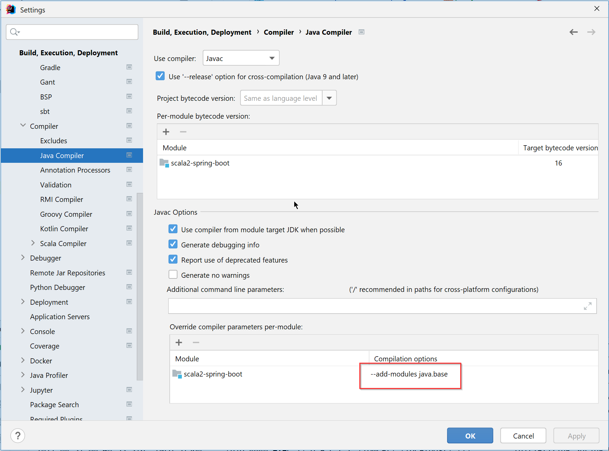

# Scala Based Spring Boot App

This app has the following features:
- using Spring Framework in Scala
- mix Java and Scala code - we should not do this. A better way is to separate
  in different modules.

With this pom.xml, java code is compiled twice. 

Without --add-modules java.base switch, Java code has syntax error

Click on the error to add this.

## Run
The app can be started from
- IntelliJ
- Maven
    - java -jar target\scala2-spring-boot-1.0-SNAPSHOT.jar
    - mvn spring-boot:run

https://javadeveloperzone.com/scala/spring-boot-scala-example/

https://github.com/rahathossain/spring-boot-scala-hello

https://dzone.com/articles/spring-boot-and-scala

https://dzone.com/articles/scala-in-java-maven-project

https://opensourcelibs.com/lib/spring-boot-scala
https://github.com/bjoernjacobs/spring-boot-scala
